# &#9812; Schach 

Dieses Schachspiel wurde im Rahmen des Projekts in Software Engineering entwickelt. 
Es umfasst ein konsolenbasiertes Schachspiel und ein GUI-basiertes Schachspiel. 
Gespielt werden kann gegen die AI, einen zweiten Spieler lokal, oder einen zweiten Spieler über ein Netzwerk. 
Ein Tutorial-Video findet sich [hier](https://www.youtube.com/watch?v=dQw4w9WgXcQ "Das beste Schach-Tutorial für das beste Schachspiel to ever exist, ich schwörs!")! 
Viel Spaß und Erfolg beim Spielen auf dem Weg zum Grandmaster! 
 

## &#9812; Zusatzfeatures
- Verbesserte KI mithilfe Min-/Max-Suche mit α/β-Pruning (5)
- Speichern/Laden von Spielen (3)
- Zweisprachigkeit (2)

## &#9812; Regeln

Die Definition von Schach Lautet wie folgt: 
Schach oder Schachspiel ist ein strategisches Brettspiel, bei dem zwei Spieler abwechselnd Spielsteine (die Spielfiguren) auf einem Spielbrett (dem Schachbrett) bewegen.  
Ziel des Spiels ist es, den Gegner schachmatt zu setzen, das heißt, dessen König/King so anzugreifen, dass diesem weder Abwehr noch Flucht möglich ist.  
 

Das Spielfeld besteht aus 64 Feldern, welche in der Horizontalen mit "a" bis "h" und in der vertikalen mit "1" bis "8" bezeichnet sind.

Pro Spielerzug kann ein Spieler genau eine Figur bewegen. Wie diese Bewegung aussieht, hängt vom Figurentyp ab. 
Figuren können, wenn sie sich auf ein Feld einer gegnerischen Figur bewegen diese schlagen. 
Geschlagene Figuren werden aus dem Spiel entfernt.  
Eigene Figuren können die Bewegung anderer eigener Figuren blockieren 
 

Jeder Spieler besitzt 16 Figuren.  
Diese Teilen sich wie folgt auf:

Bauer/Pawn: 
Jeder Spieler besitzt acht Pawns.  
Ein Pawn kann sich exakt ein Feld nach vorne bewegen.  
Befindet sich eine gegnerische Figur auf einem schräg vorne gelegenen Feld (links oder rechts),  so kann der Pawn sich ein Feld schräg nach vorne auf das Feld der gegnerischen Figur bewegen und sie schlagen. 
Ein Pawn, der sich im laufenden Spiel noch nicht bewegt hat, kann sich einmalig zwei Felder vorwärts bewegen. 
 

Läufer/Bishop: 
Jeder Spieler besitzt zwei Bishops. 
Sie können sich beliebig viele Felder Diagonal über das Feld bewegen. 
Ein Bishop kann daher seine Feldfarbe niemals ändern und ist daher in seiner Reichweite eingeschränkt. 
Allerdings können die zwei Bishops sich so niemals gegenseitig blockieren und gut zusammen agieren. 
 

Springer/Knight: 
Jeder Spieler besitzt zwei Knights. 
Ihre Bewegung ist am speziellsten; Sie können sich niemals in einer geraden Linie bewegen. 
Ein Zielfeld liegt stets zwei Reihen und eine Spalte oder umgekehrt zwei Spalten und eine Reihe vom Ausgangsfeld. 
Zwischenfelder zwischen Start- und Zielposition dürfen dabei besetzt sein. 
 

Turm/Rook: 
Jeder Spieler besitzt zwei Rooks. 
Ein Turm kann sich beliebig viele Felder horizontal oder vertikal bewegen. 
Durch diese Bewegung kommen sie zunächst nur langsam ins Spiel, besitzen aber immensen Wert im weiteren Spielverlauf. 
 

Dame/Queen: 
Jeder Spieler besitzt eine Queen. 
Sie ist die beweglichste und damit stärkste Figur. 
Ihre Bewegung ist eine Vereinigung von Bishop und Rook. 
Sie kann sich beliebig viele Felder horizontal, vertikal oder diagonal über das Feld bewegen. 
 

König/King: 
Jeder Spieler besitzt einen King. 
Er ist die wichtigste Figur im Spiel. 
Seine Reichweite ist eingeschränkt, die Richtung jedoch flexibel. 
Er kann sich ein Feld in eine beliebige Richtung bewegen. 
 

Einige Figuren können eine Reihe von Sonderzügen machen. 
Diese werden in einem späteren Abschnitt zusammen mit den entsprechenden Steuerungen erklärt.

Wird eine Figur so bewegt, dass sie im nächsten Zug potentiell den King des gegnerischen Spielers schlagen könnte, so muss der gegnerische Spieler seinen King aus der Schachsituation befreien. 
Er kann dies durch einfaches Bewegen des King aus dem bedrohten Feld erreichen, indem er eine andere Figur in den Pfad der schachsetzenden Figur bewegt, oder die schachsetzende Figur mit einer eigenen Figur schlagen (z.B. dem King selbst). 
Hat ein King, der im Schach steht zu einem Zeitpunkt keine dieser Möglichkeiten, so ist er schachmatt gesetzt und das Match ist beendet. 
Der schachmatt gesetzte Spieler verliert. 
 

### &#9812; Spielstart

Zu Verfügung stehen eine konsolenbasierte Version des Spiels und eine GUI-basierte Version des Spiels 
Über die Startargumente lässt sich wählen, welche Version gestartet werden soll. 
In beiden Versionen kann gegen eine andere Person (lokal und im Netzwerk) oder gegen eine Schach-KI gespielt werden. 
Die KI hat zwei Schwierigkeitsgrade; Simple und MinMax, d.h. leicht und schwer. 
 

### &#9812; Konsolenbasiertes Spiel

Nach dem Spielstart erfolgen zunächst eine ganze Reihe von Abfragen, zunächst für die Sprache des Spiels: 

`Do you want to play in english 'yes'?`, bzw 
`Moechtest du in deutsch spielen 'ja'?`  

Es folgen hier die Englischen Abfragen, die mit der Eingabe `yes` erscheinen. Alle Eingaben und ihre Effekte werden erklärt: 

`You can save & load the game. You can load the game at the start of a new game, if there is already a game saved. You can save it at any point in a game with entering command 'save'. Do you want to load the saved game? (yes) / (no)`  

Möchte man ein zuvor gespeichertes Spiel laden, so wird man aufgefordert, den Dateipfad zum Speicherstand im `.txt`-Format einzugeben: 

`Enter the absolute path to your .txt file: You could use something like: 
/Users/carl\\ENTER_HERE_YOUR_FILENAME.txt ` 

Ist die Eingabe korrekt gewesen, wird der Spielstand geladen und das Match beginnt. Ist sie falsch, so erscheint der Initiale Dialog zum Speichern oder Laden erneut.  

Hat man jedoch angegeben, kein Spiel zu laden, so wird der Spieler gefragt, ob er gegen die Schach-KI oder einen richtigen Spieler spielen möchte:  

`Playing against computer ('computer') or another human ('human')?`  

Hier teilen sich die Pfade erneut etwas, wir bleiben zunächst beim Spiel gegen die KI.  

Mit der Eingabe `computer` öffnet sich ein weiterer Dialog zur Wahl der Farbe: 

`do you want to play as white 'white', or black 'black'?`  

Unabhängig der letztendlichen Farbwahl, wird anschließend gefragt, ob gegen die einfache oder die schwere Schach-KI gespielt werden soll: 

`do you want to play against a simple ai 'simple', or against a ai using min-max algorithm 'minmax'?`  

Mit der Eingabe `simple`startet das Spiel gegen die einfache KI. 
Mit der Eingabe `minmax` wird gefragt, wie schwer die Minmax-KI sein soll:  

`Choose the maxDepth for minmax search! ('1','2','3','4')` 

Hat man einen Schwierigkeitsgrad gewählt, startet das Spiel gegen die KI. 
 
Nun zurück zur Wahl zwischen KI und echtem Spieler. Hat man hier `human` geantwortet, so wird gefragt, ob man über ein Netzwerk spielen möchte: 

`Want to play a network game? ('yes'/'no')`  

Antwortet man hier `no`, startet das lokale Spiel. 
Antwortet man hier `yes`, wird gefragt, ob man ein Spiel hosten oder einem gehosteten Spiel beitreten möchte:  

`If you haven't setup a Server, you can do that by entering 'server', otherwise the connection could fail! do you want to launch the 'server' or connect as 'client'?`  

Als `server` erhält man als Antwort seine lokale IP-Adresse: 

`Send this IP to Client: 192.168.0.XXX` 

Als Client hingegen wird man nach der IP des Servers gefragt: 
`Enter IP:` 

Wurde diese korrekt eingegeben, startet das Netzwerkspiel. Als Server wartet man so lange, bis ein Client sich erfolgreich verbunden hat. Als Server hat man außerdem stets den ersten Zug, also spielt mit den weißen Pieces. Dies am besten vorher mit seinem Partner absprechen. 
>Wichtig: Damit das Netzwerkspiel korrekt startet, muss der Server aktiv sein, bevor der Client versucht eine Verbindung herzustellen!  

Nach den Auswahlen für die Spielmodi wird das Schachbrett in die Konsole geladen. 
Der Output sieht wie folgt aus:

>Welcome to Chess Match 
>8&nbsp;&nbsp;r&nbsp;&nbsp;n&nbsp;&nbsp;b&nbsp;&nbsp;q&nbsp;&nbsp;k&nbsp;&nbsp;b&nbsp;&nbsp;n&nbsp;&nbsp;r  
>7&nbsp;&nbsp;p&nbsp;&nbsp;p&nbsp;&nbsp;p&nbsp;&nbsp;p&nbsp;&nbsp;p&nbsp;&nbsp;p&nbsp;&nbsp;p&nbsp;&nbsp;p  
>6                          
>5                          
>4                          
>3                          
>2&nbsp;&nbsp;P&nbsp;&nbsp;P&nbsp;&nbsp;P&nbsp;&nbsp;P&nbsp;&nbsp;P&nbsp;&nbsp;P&nbsp;&nbsp;P&nbsp;&nbsp;P  
>1&nbsp;&nbsp;R&nbsp;&nbsp;N&nbsp;&nbsp;B&nbsp;&nbsp;Q&nbsp;&nbsp;K&nbsp;&nbsp;B&nbsp;&nbsp;N&nbsp;&nbsp;R  
>&nbsp;&nbsp;&nbsp;&nbsp;&nbsp;&nbsp;a&nbsp;&nbsp;b&nbsp;&nbsp;c&nbsp;&nbsp;d&nbsp;&nbsp;e&nbsp;&nbsp;f&nbsp;&nbsp;g&nbsp;&nbsp;h

Die Großbuchstaben stehen dabei für die weißen Figuren und Kleinbuchstaben für die schwarzen Figuren. 
 

#### &#9812; Spielerzüge

Weiß hat den ersten Zug. 
Spielerzüge müssen als Figurenstart- und Figurenzielpositionen in die Konsole eingegeben werden: 
`Startposition-Zielposition` 
Ein beispielhafte Eingabe könnte so ausshen: 
`a2-a3` 
Wichtig ist dabei, dass bei der Eingabe von Zügen Kleinbuchstaben verwendet werden müssen, unabhängig davon, ob Schwarz oder Weiß am Zug ist. 
 

#### &#9812; Sonderzüge
Spieler können Sonderzüge wie die Pawn-Promotion, En passant und Castling durchführen. 
 
Pawn-Promotion: Erreicht ein Pawn die Grundlinie des gegnerischen Spielers,  wird er durch eine beliebige andere Figur ersetzt (ausgenommen King). 
 
Castling: Wurden sowohl der Rook als auch der King noch nicht bewegt und stehen keine anderen Figuren zwischen ihnen, ist Castling möglich. Dabei tauschen Rook und King ihre Positionen, sodass sie zentral von ihren Ausgangspositionen stehen.  Es wird zwischen Long Castling und Short Castling unterschieden, je nachdem mit welchem Rook die Positionen getauscht werden. 
 
En passant: Unbewegte Pawns haben die Möglichkeit einen Doppelschritt zu gehen. Würde ein Pawn auf diese Weise den Schlagbereich eines gegnerischen Pawns überspringen, so hat der gegnerische Pawn die Möglichkeit, "en passant" zu schlagen. 
 
Sonderzüge werden wie folgt in die Konsole eingegeben: 
`e1-g1` für eine beispielhafte Rochade für Weiß und 
`a7-a8Q` für eine weiße Pawn-Promotion (sofern sich ein weißer Pawn auf `a7` befindet), 
wobei der Buchstabe hinter der Zielposition für die zu erzeugende Figur der Pawn-Promotion steht. 
Wird keine Angabe gemacht, wird der Pawn automatisch zu einer Queen promoted. 
Eingaben für en passant erfolgen so, wie das reguläre Schlagen auch. 
 

#### &#9812; Zusatzeingaben
Zusätzlich können bereits geschlagende Figuren mit der Eingabe 
`beaten` 
in die Konsole ausgegeben werden. 
Weiterhin lässt sich das spiel mit `save` speichern. 
Mit `English` bzw. `Deutsch` kann die Sprache des Spiels jederzeit angepasst werden. 
 

#### &#9812; Spielverlauf
Nach einem Spielerzug wird das Schachbrett mit den neuen Figurenpositionen in die Konsole ausgegeben. 
Der Beispielzug `a2-a3` von oben generiert so den folgenden Output: 

>8&nbsp;&nbsp;r&nbsp;&nbsp;n&nbsp;&nbsp;b&nbsp;&nbsp;q&nbsp;&nbsp;k&nbsp;&nbsp;b&nbsp;&nbsp;n&nbsp;&nbsp;r  
>7&nbsp;&nbsp;p&nbsp;&nbsp;p&nbsp;&nbsp;p&nbsp;&nbsp;p&nbsp;&nbsp;p&nbsp;&nbsp;p&nbsp;&nbsp;p&nbsp;&nbsp;p  
>6                          
>5                          
>4                          
>3&nbsp;&nbsp;P                          
>2&nbsp;&nbsp;&nbsp;&nbsp;&nbsp;P&nbsp;&nbsp;P&nbsp;&nbsp;P&nbsp;&nbsp;P&nbsp;&nbsp;P&nbsp;&nbsp;P&nbsp;&nbsp;P  
>1&nbsp;&nbsp;R&nbsp;&nbsp;N&nbsp;&nbsp;B&nbsp;&nbsp;Q&nbsp;&nbsp;K&nbsp;&nbsp;B&nbsp;&nbsp;N&nbsp;&nbsp;R  
>&nbsp;&nbsp;&nbsp;&nbsp;&nbsp;&nbsp;a&nbsp;&nbsp;b&nbsp;&nbsp;c&nbsp;&nbsp;d&nbsp;&nbsp;e&nbsp;&nbsp;f&nbsp;&nbsp;g&nbsp;&nbsp;h

Mit jedem legitimen Zug wird das Board immer wieder neu ausgegeben. Je nach Modus werden mit dem Board zusammen Informationen zum Zug ausgegeben (beispielsweise ob und welcher  Zug von der KI oder einem Spieler gemacht wurde. Ein beispiel folgt für die KI). 
 

#### &#9812; Spielverlauf gegen die KI
Entscheidet man sich zu beginn gegen die KI zu spielen, so wird nach jedem eigenen Zug ein zusätzlich zum aktualisierten Board ein zusätzlicher Output generiert. 
Dieser Umfasst bei der einfachen KI die Zeile 
`SimpleAI move was !` zusammen mit dem zugehörigen Zug in bekannter Form. 
 
Die MinMax-KI benötigt etwas Bedenkzeit, diese erzeugt bei schwarzer KI-Farbe den Output 
`MinMaxAI is thinking 10000111100101100...` 
und bei weißer KI-Farbe den Output 
`MinMaxAI is thinking 10100111001...` 
 
Nachdem die MinMax-KI zu Ende überlegt hat, wird ihr Zug zusammen mit dem Output 
`MinMaxAI move was !`  
in die Konsole ausgegeben zusammen mit ihrem zugehörigen Zug in bekannter Form. 
 

#### &#9812; Abfangen von inkorrekten Eingaben
Eingaben, die syntaktisch korrekt, jedoch aber regelwidrig sind geben das Schachbrett unverändert aus und ereugen den Output: 
`!Move not allowed` 

Eingaben, die syntakisch inkorrekt sind, geben das Schachbrett ebenfalls unverändert aus und erzeugen den Output: 
`!Invalid move` 
 
Anschließend wird auf erneuten, korrekten Input eines validen Zuges gewartet. 
 

#### &#9812; Schachsetzen von Spielern
Nachdem ein Spieler einen Zug macht, der seinen Gegenspieler in Schach setzt, wird mit dem  
aktualisierten Board zusätzlich der folgende Output generiert: 
`White is check` bzw.  
`Black is check` 

Dieser Output wird ebenfalls generiert, wenn ein Spieler sich im Schach befindet,  jedoch einen Zug eingegeben hat, der ihn nicht aus dem Schach befreit. 
 Er hat dann erneut die Möglichkeit, einen korrekten Zug einzugeben.

Wurde ein Spieler durch einen Zug schachmatt gesetzt, wird mit dem aktualisierten Board zusätzlich 
der folgende Output generiert: 
`White Wins!!!` beziehungsweise `Black Wins!!!`
 

Resultiert das Spiel in einer Pattsituation, wird der folgende Output generiert: 
`Is stalemate` 
 

### &#9812; GUI-basiertes Spiel

Das GUI-basierte Spiel umfasst zwei Ansichten; 
Den Startscreen, auf dem man Einstellungen für die Partie vornimmt und den Gamescreen, der das Schachbrett beinhaltet. 
 
Die standardmäßig ausgewählte Sprache ist Englisch, unter der Einstellung "Language/Sprache" lässt sie sich jedoch auch auf Deutsch umstellen. 
Im Startscreen lassen sich verschiedene Einstellungen für das zu startende Spiel vornehmen. 
 
Standardmäßig ist hier die Option gewählt, gegen einen anderen, menschlichen Spieler zu spielen.
 

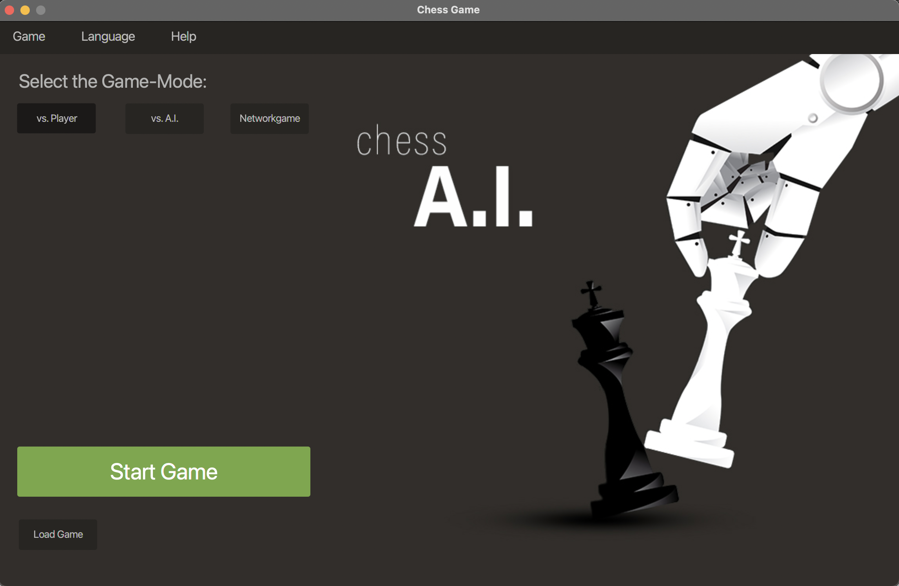
 

Des weiteren besteht die Option, wie im konsolenbasierten Spiel auch, gegen die Schach-KI zu spielen. 
Der Dialog aus dem konsolenbasierten Spiel wird durch einfache, klickbare Auswahlmöglichkeiten ersetzt. 

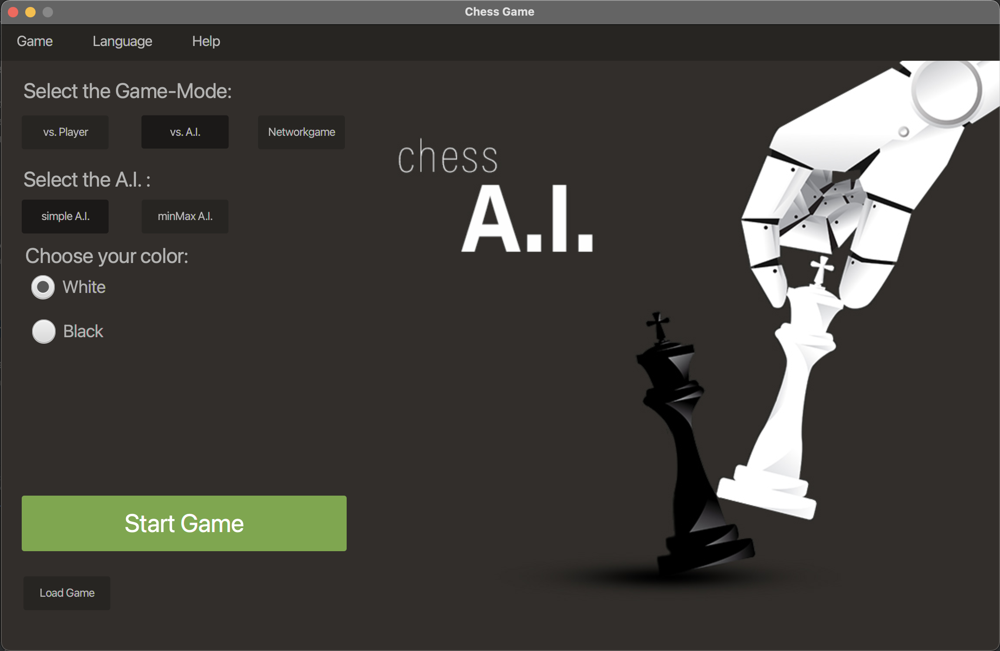
 

Die dritte Auswahlmöglichkeit bietet die Option, über ein Netzwerk gegen einen anderen menschlichen Spieler zu spielen. 
Wie zuvor auch, lässt sich auswählen, ob man als Server ein Spiel hosten will, oder als Client zu einem Host verbindet. 
Als Server wird mit einem Klick auf "Start Game/Spiel starten" ein Spiel gehosted. 
Als Client muss zuvor noch im Eingabefenster die _lokale_ IP-Adresse des Servers eingegeben werden, bevor das Spiel gestartet werden kann. 

Auch hier ist wieder wichtig, dass der Server online ist, bevor vom Client versucht wird eine Verbinung herzustellen.

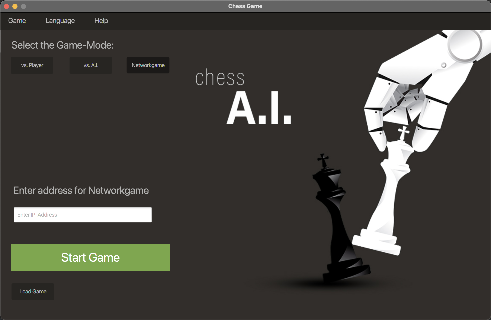
 

Es besteht neben den bisher genannten Optionen auch die Möglichkeit, ein zuvor gestartetes und gespeichertes Spiel zu laden. 
Diese Funktion findet sich unter "Load Game/Spiel laden". 
Wurde mittels der "Save Game/Spiel Speichern"-Option während eines laufenden Matches das Spiel gespeichert, so kann es hier vom Startbildschirm aus wieder gestartet werden. Dazu öffnet sich der Filechooser: 

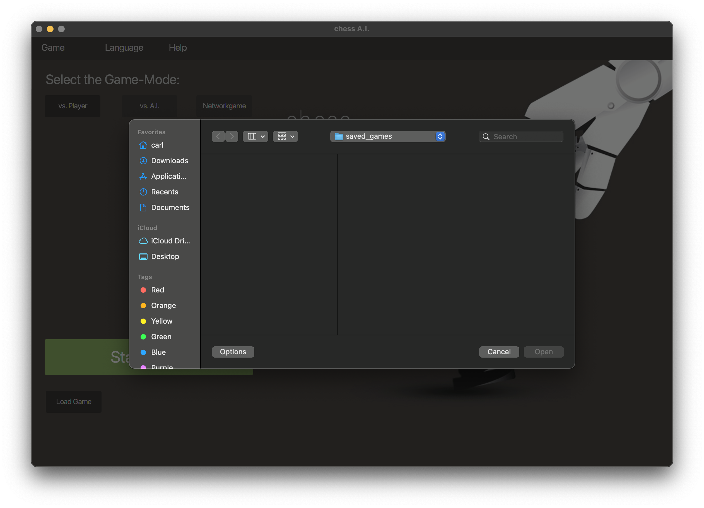
 
Wurden zuvor Spiele gespeichert, so werden die Spielstände hier als Files angezeigt.  
  

Nachdem man alle gewünschten Einstellungen für das zu startende Spiel vorgenommen hat, lässt sich die Partie mit einem Klick auf "Start Game/Spiel Starten". 
Darufhin öffnet sich der Gamescreen mit dem Schachfeld: 

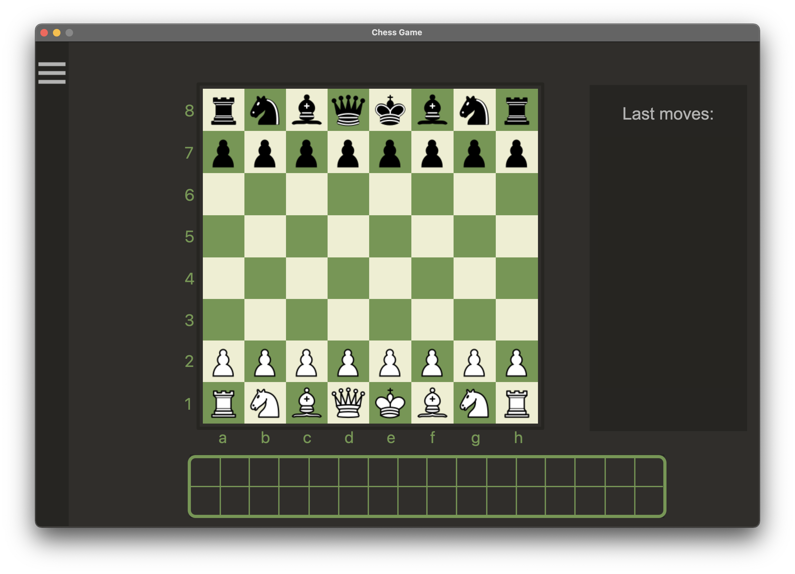
 

Zur rechten Seite vom Schachfeld findet sich eine Movehistory, welche kontinuierlich durchgeführte, legale Züge ausgibt. 
Unterhalb des Schachfelds findet sich ein Graveyard, der kontinuierlich und in chronologischer Reihenfolge geschlagene Figuren ausgibt. 
In der linken, oberen Ecke findet sich ein ein-/ausklappbares Burgermenü mit verschiedenen Einstellungen für das laufende Spiel: 

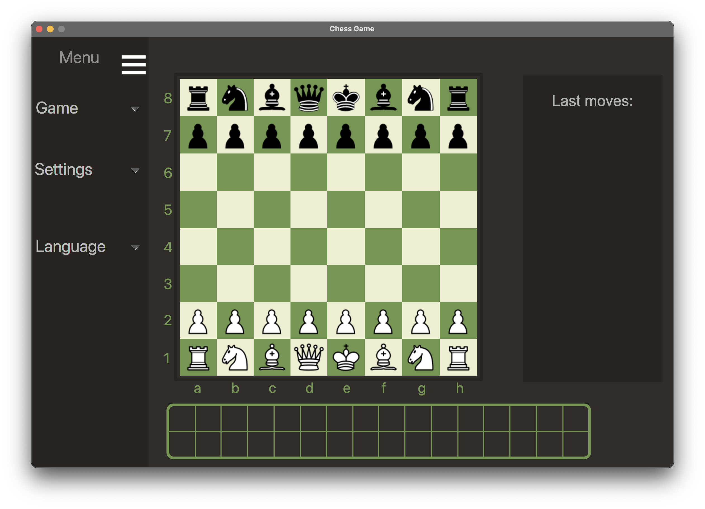
 

Unter "Game/Spiel" lässt sich das laufende Spiel speichern, schließen und man kann zum Startbidlschirm zurückkehren.

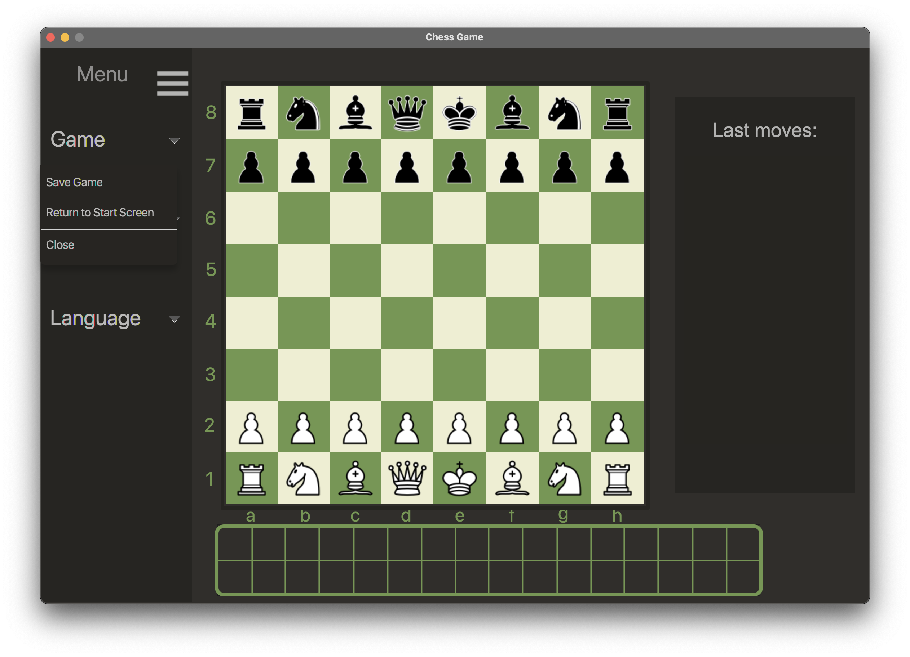
 

Möchte man das laufende Spiel speichern, so öffnet sich mit einem Klick auf "Save Game/Spiel speichern" der Filechooser als Overlay, in dem man dem File des Spielstands einen Namen geben kann. Dieses File wird anschließend in einem speziellen Directory angelegt und gespeichert:

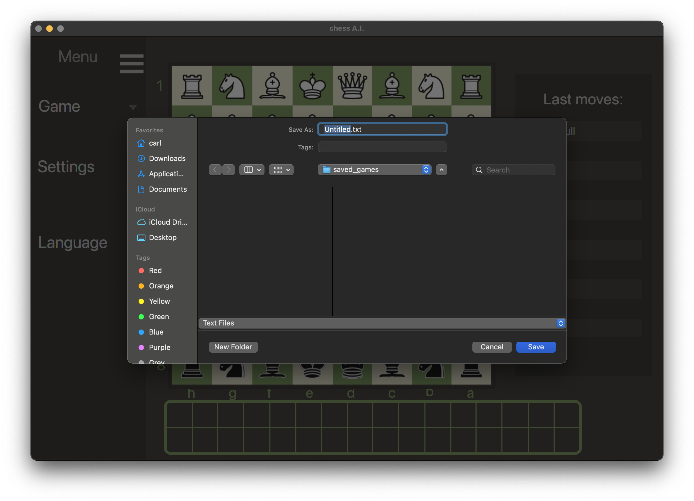

Unter "Settings/Einstellungen" lassen sich verschieden Spielbezogene Einstellungen an- oder ausschalten. 
Standardmäßig sind alle Einstellungen zu Spielbeginn aktiviert. 
Dazu gehören: 

- Mögliche Züge einer angewählten Figur anzeigen
- Hinweis darauf, ob sich ein Spieler im Schach befindet
- Rotation des Spiefeldes nach jedem durchgeführten Zug
- Das ändern einer Gewählten Figur für einen Zug

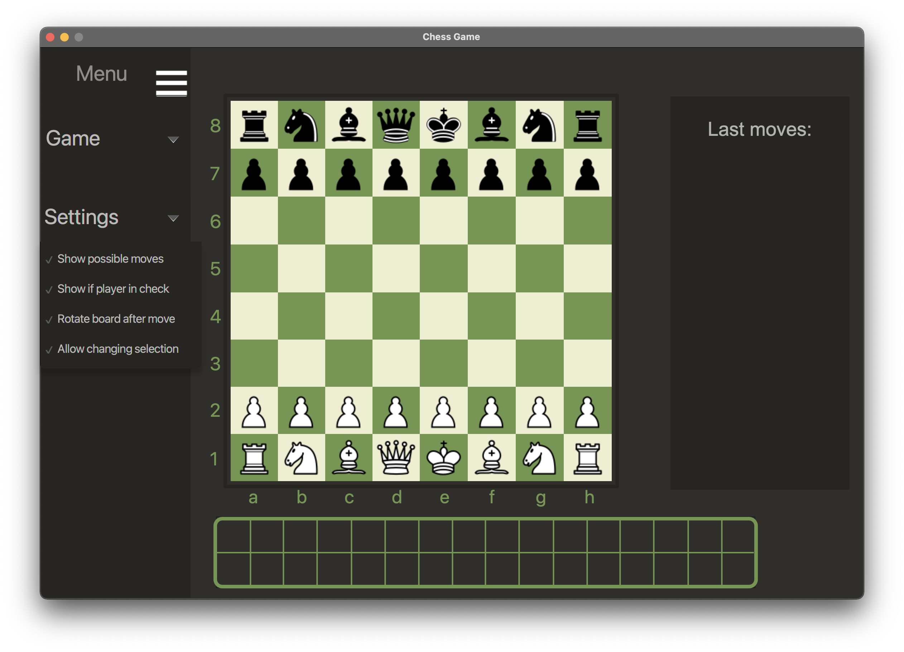
 

Unter "Language/Sprache" lässt sich die Sprache des Spiels von Englisch auf Deutsch und umgekehrt ändern.

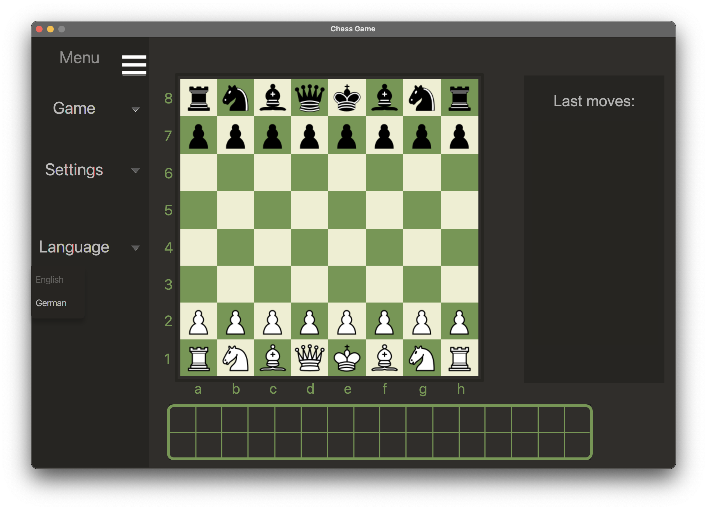
 

Wie gewohnt hat Weiß den ersten Zug, egal ob bei einem Spiel gegen die KI oder gegen einen anderen Spieler. 
Mit einem Klick können gewünschte Figuren angewählt werden. 
In diesem Beispiel wurde der weiße Pawn auf dem Feld c2 angewählt. 

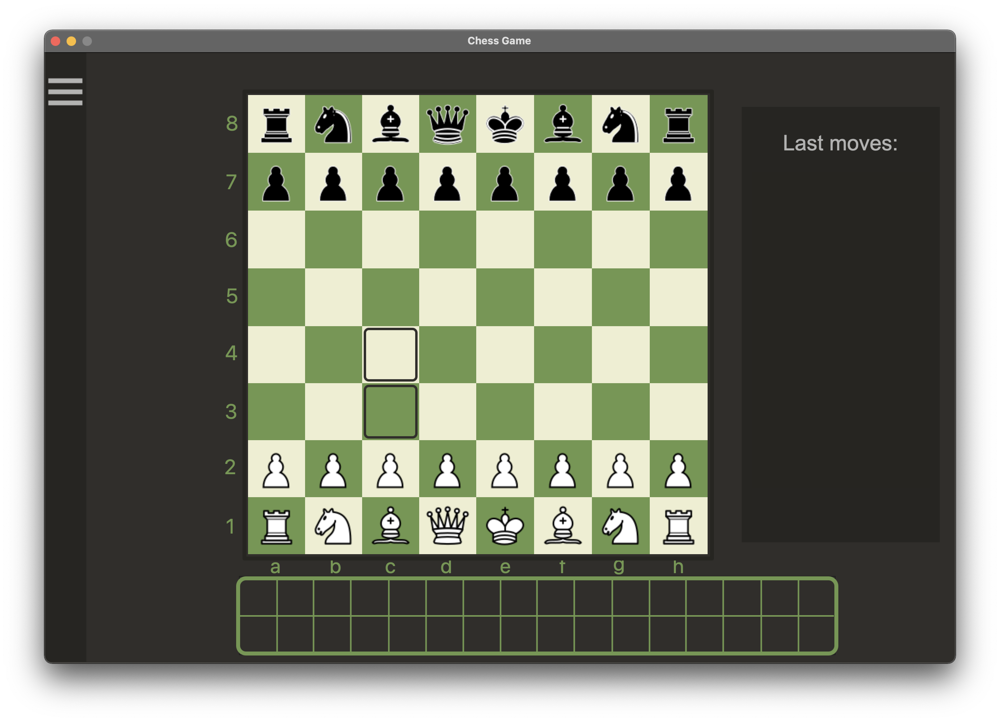
 

Mit einem zweiten Klick auf ein Zielfeld, wird die gewählte Figur auf das gewünschte Feld bewegt und das Spielfeld rotiert (je nach gewählter Einstellung). 
Der durchgeführte Zug wird in die Movehistory ausgegeben. 

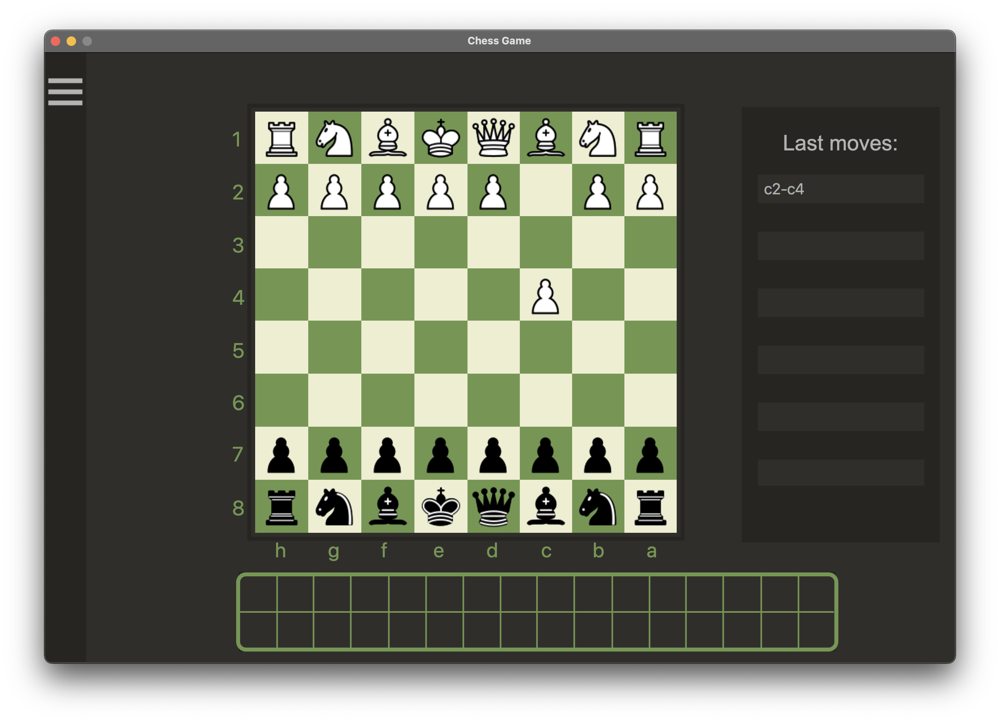
 

Wird eine Figur geschlagen, so wird sie in den Graveyard ausgegeben. 

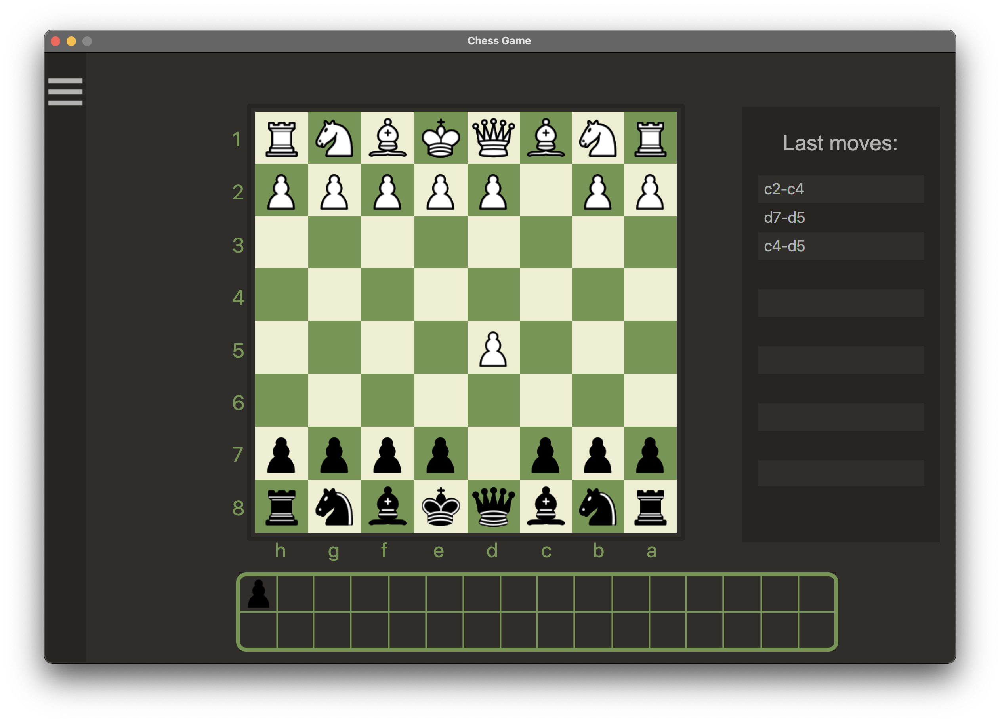
 

Steht ein Spieler im Schach, so wird eine entsprechende Mitteilung über dem Schachfeld ausgegeben. 

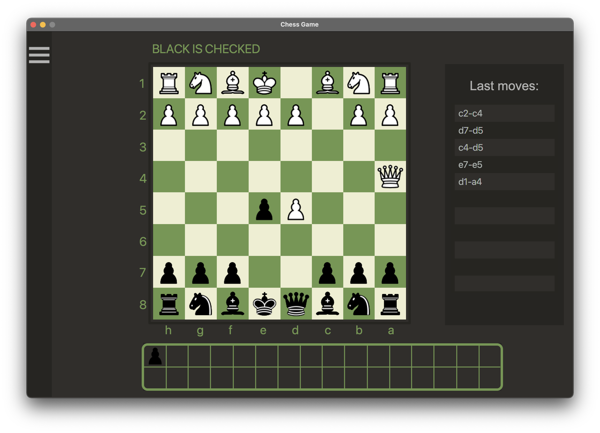
 

Wird ein Spieler schachmatt gesetzt, so erscheint eine entsprechende Mitteilung über dem Schachfeld. 

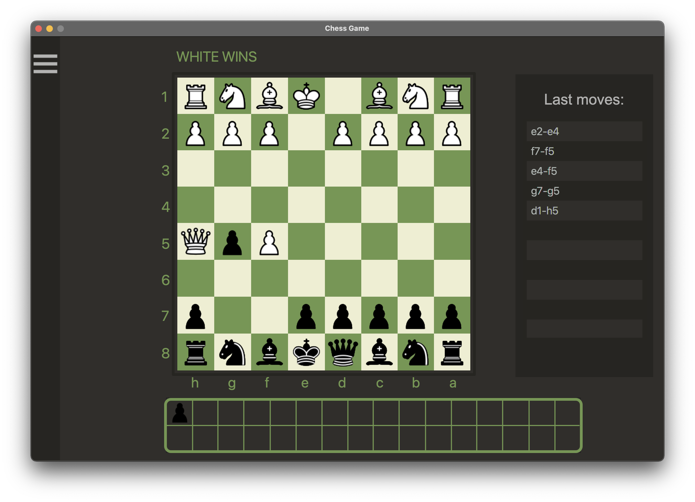

## Wir wünschen viel Spaß beim Spielen! 

